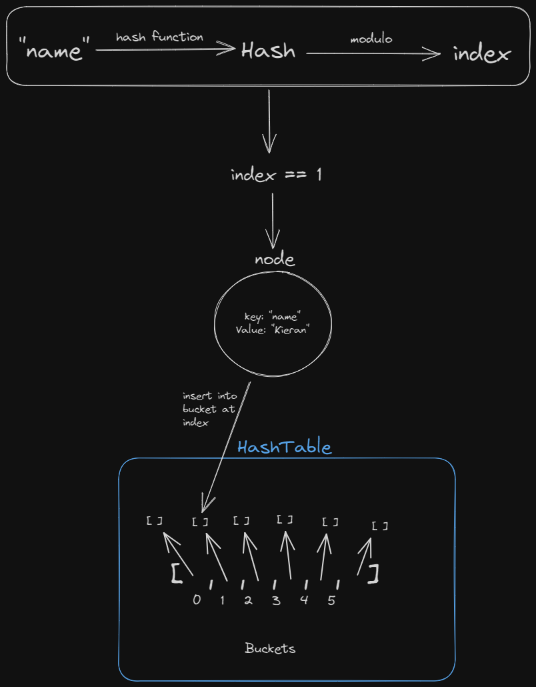
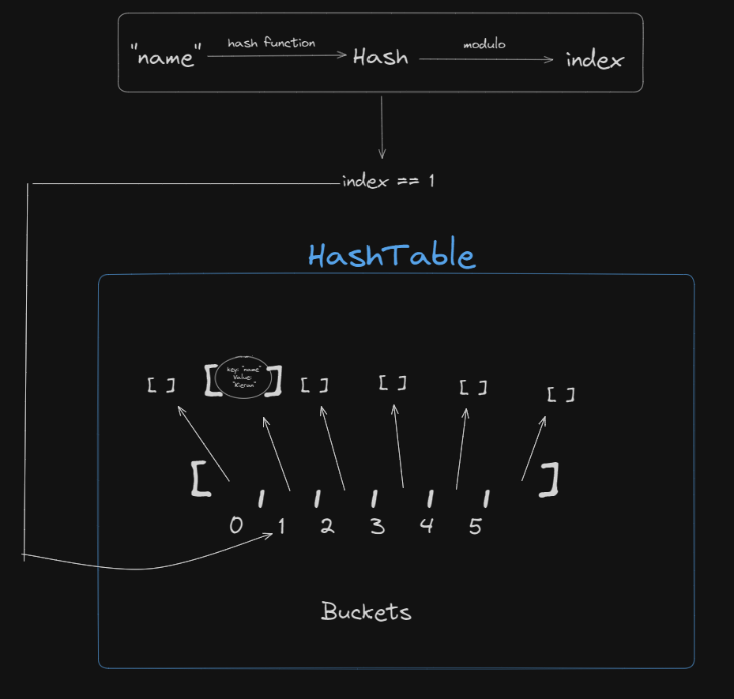
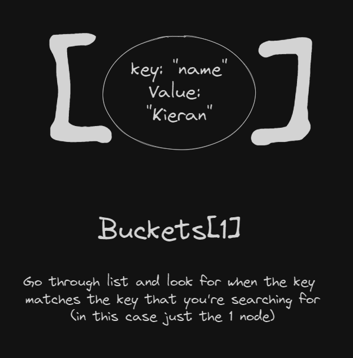
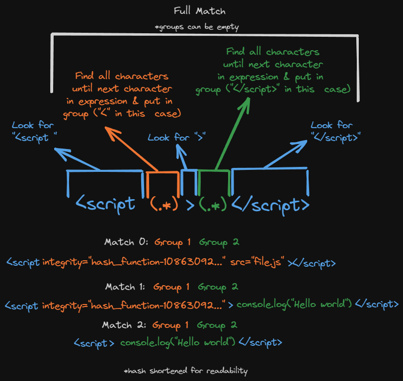

# Hashing

This is a helper repository to the blog post on `https://schulichignite.com/blog/<ENTER URI>` that explains a basic hashing algorithm, and it's uses. You can find useful resources here:

- [Associated blog post (TODO)]()
- [Ignite Definition of hashing](https://schulichignite.com/definitions/hashing)

Specifically this will walk through:

1. Creating a custom [hash function](https://en.wikipedia.org/wiki/Hash_function)
2. Creating a password storage and validation system
3. Creating a [HashTable](https://en.wikipedia.org/wiki/Hash_table#:~:text=It%20is%20an%20abstract%20data,the%20corresponding%20value%20is%20stored.)
4. Creating a [subresource integrity](https://developer.mozilla.org/en-US/docs/Web/Security/Subresource_Integrity) scheme from scratch

## Hashing algorithm

You can find the hashing algorithm in `hashing.py`, this function will be used in the other files and is called `hash_function()`. The basic steps are:

1. Convert the input value to string if it's another data type
2. Start with the number 1, for each character in the input multiply the current hash by the index of the character in the following lokoup table:

```python
ASCII_TABLE = ['0', '1', '2', '3', '4', '5', '6', '7', '8', '9', 'a', 'b', 'c', 'd', 'e', 'f', 'g', 'h', 'i', 'j', 'k', 'l', 'm', 'n', 'o', 'p', 'q', 'r', 's', 't', 'u', 'v', 'w', 'x', 'y', 'z', 'A', 'B', 'C', 'D', 'E', 'F', 'G', 'H', 'I', 'J', 'K', 'L', 'M', 'N', 'O', 'P', 'Q', 'R', 'S', 'T', 'U', 'V', 'W', 'X', 'Y', 'Z', '!', '"', '#', '$', '%', '&', "'", '(', ')', '*', '+', ',', '-', '.', '/', ':', ';', '<', '=', '>', '?', '@', '[', '\\', ']', '^', '_', '`', '{', '|', '}', '~', ' ', '\t', '\n', '\r', '\x0b', '\x0c']
```

3. Fix the length of the output to 128 characters.
    - If the resulting hash is less than 128 characters take the difference between the current length of hash and 128, for each of those characters append the character at the index of the current loop itteration in the lookup table (see below for example)
    - if longer truncate to the first 128 characers

Here is the code for step 3:

```python
if len(hash) < 128:
    for number in range(128-len(hash)):
        if number > 99: # Only single digit values allowed
            number //= 100
        elif number > 9:
            number //=10
        hash += str(number)
```

For example if you had a hash with 126 characters then the loop would start '0' would be appended to end of current hash, then on next itteration '1' would be appended. Leaving us with `<current_hash>10` to pad it to 128. Since we want exactly 128 characters we go to 9, then strip the digit for every digit added (i.e. 101 would become 1, and 20 would become 0)

The biggest problem with this approach is there are tons of collisions. Any text which contains the same first 128 characters (an anagram) will **always** collide (this was somewhat intentional to be able to show how bad collisions are for performance of HashTables).

## Password storage

`passwords.py` contains code to create `User` instances with password storing that includes [salt & peppering](https://stackoverflow.com/questions/16891729/best-practices-salting-peppering-passwords) with the hash function in `hashing.py`.

## HashTable

A HashTable is a data structure that let's you store key-value pairs. An example of something that implements this functionality in python is a dictionary. You can specify keys, which then have values associated, those values can then be accessed via the keys:


```python
# Instantiating a dictionary
user = {"name": "kieran", "age": 24}

# Accessing/searching/finding values by their keys
print(user["name"]) # "kieran"
print(user["age"]) # 24

# Adding new key-value pairs
user["email"] = "kieran@canadiancoding.ca"
```

We will need some classes to recreate this functionality:
```python
from typing import List, Any
from dataclasses import dataclass

@dataclass
class Node:
    key: str
    value: Any

@dataclass
class HashTable:
    buckets: List[List[Node]]
```

A node will be where we store the key-value pair, which will then be placed into our buckets list/Array. We also need to decide how many buckets we want, for now we will arbitrarily pick 6 (because it makes the drawings easier 😉) but we will discuss what more or less buckets does shortly. The basic idea is that we will use a hashing function to generate an index location in the buckets list, we will then insert the node at that index in the buckets list. This means that for searching later we can skip searching all values in any of the other buckets!

So the insertion would take the steps:

1. Create HashTable with 6 empty buckets
2. Take the key you want to insert and hash it with some algorithm (make sure resulting hash is just numbers)
3. Take that hash and modulo (divide by and take the remainder) it by the number of buckets (in our case 6)
4. Create a node which contains the value and the key
5. Insert the node into the index you calculated from the key



Then to search/find you can do:

1. Take the key you want to find and hash it with some algorithm (make sure resulting hash is just numbers)
2. Take that hash and modulo (divide by and take the remainder) it by the number of buckets (in our case 6)
3. Look into the HashTable at the given index, if list at index is empty throw an error, if not then go through the list at that index and check each node in the list until you find one with the same key, if you hit the end of the list then throw an error




Full code for implementing this can be found in `hashtables.py`. We covered `HashTable`, but `HashTableImproved` is the same idea, except instead of using regular function calls, we can use the exact same syntax as dictionaries:

```python
ht2 = HashTableImproved()

## Add key-value pairs
ht2["novelty"]=10
ht2["yeotlvn"]=11
ht2["voetlny"]=12
ht2["eoltvyn"]=13
ht2["asdfgsdfg"]=10

## Uses __repr__() and __str__()
print(ht2) # HashTableImproved: {'novelty':10,'yeotlvn':11,'voetlny':12,'eoltvyn':13,'asdfgsdfg':10}

## Access values by key
print(ht2["novelty"])# 10
print(ht2["yeotlvn"])# 11
print(ht2["eoltvyn"])# 13

## Access non-existant keys
print(ht2["Ay Lmao"]) # Raises an error
```

## Integrity

When you’re downloading a file from the internet you are fundamentally getting it from a network. How do you know that someone has not replaced the original file in transit to your device? How do you know the image your downloading isn’t actually some malicious code? One way to check is with integrity hashes.

Integrity hashes have been around for a while, on the early days of the internet md5 file hashes were common to see on websites you donwloaded software from. Even though security has gotten better since the 2000’s it’s still a concerning prospect that you might be downloading unsafe files. The most concerning of these are files you don’t even choose to download.

When you run javascript on a webpage you often first have to download the file from somewhere. Typically this is done by including a URL in the src attribute of a script tag. Let’s say for example our file is hosted on https://schulichignite.com/file.js we could do:

```html
<script src="https://schulichignite.com/file.js"></script>
```

Well, with our knowledge of hashes we can use a built-in attribute called subresource integrity to add integrity hashes to our javascript. All we do is include an integrity attribute that tells the browser which hash function to use (in our case SHA-1) and then the hash. For example:

```html
<script src="https://schulichignite.com/file.js" integrity="sha1-865cd55417af5a27ab17ae1fff7510c7acc4f250" crossorigin="anonymous"></script>
```

Now when the browser downloads the file it will run the contents as a string through the SHA-1 hashing algorithm, then check against `865cd55417af5a27ab17ae1fff7510c7acc4f250`, and only run it if it matches. In order to do this we are going to use [regex](https://en.wikipedia.org/wiki/Regular_expression). You technically [don't want to use regex for this parsing](https://blog.codinghorror.com/parsing-html-the-cthulhu-way/). However it's the easiest way, so it's what we're going to do. Here is roughly an image of how the regex in the file works:



From these matches we use the first group to get the attributes, and the second to get the inline JS. We then check for an integrity attribute, and then if there is one we check the src or inline js against the hash value. The implementation can be found in `integrity.py`.
